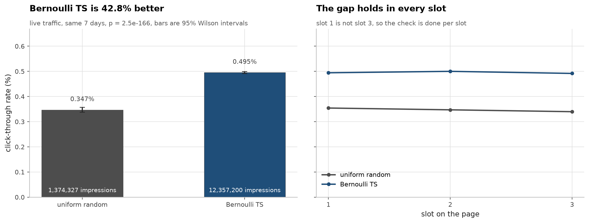
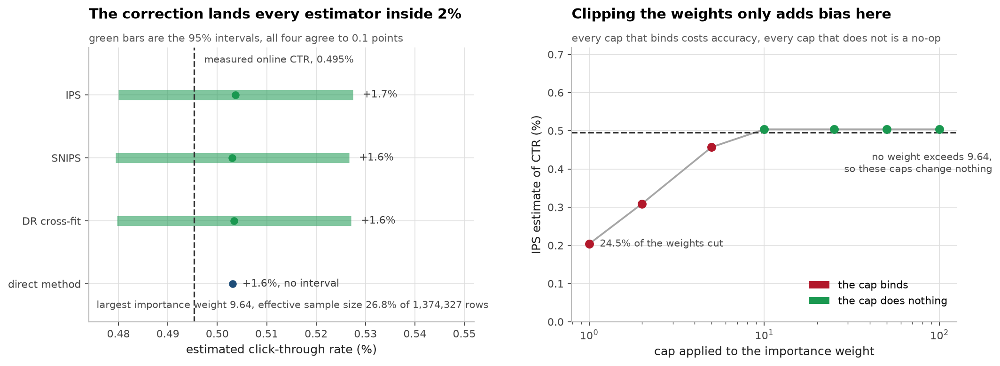
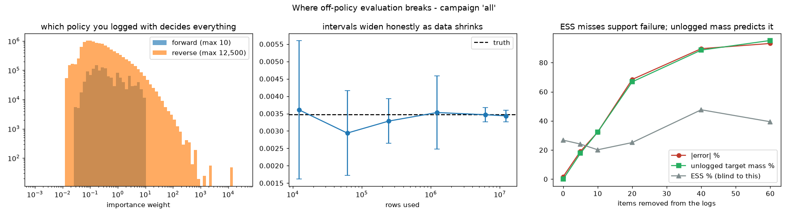

# Offline metrics vs online lift — checking recommender evaluation against a known answer

Built by a third-year Applied Computer Science (AI) student.

> **Status: in progress.** Milestones 1–5 are done — ground truth, naive
> evaluation, corrected estimators, stress tests, and an evaluation gate that
> refuses to report a number when the diagnostics say it would be meaningless.
> The final write-up remains. Numbers below are real and reproducible.

The problem with a recommender portfolio project is that the metric you report
is not the thing anyone cares about. You train a ranker, you report NDCG@10 or
AUC, and none of it tells you whether deploying it would earn more clicks than
what you already have. The offline number and the online number are different
quantities, and a project that only shows the offline one cannot tell you if it
was any good.

So this uses the one public dataset where the online answer is already known.
**Open Bandit Dataset** (ZOZOTOWN) logged real production traffic under two
different policies at the same time — a uniform-random one and a Bernoulli
Thompson Sampling one — and recorded the probability of every action taken.
That means the true online CTR of each policy is measured, and any offline
estimate computed from one policy's logs can be graded against it.

The whole project is one question: **using only the random logs, can you work
out how well BTS performs?** The answer is written down before any estimator
runs.

---

## The known answer

7 days of live traffic, both policies running concurrently over 80 items.

| policy | impressions | clicks | CTR | 95% CI |
|---|---|---|---|---|
| uniform random | 1,374,327 | 4,768 | 0.00347 | [0.00337, 0.00357] |
| Bernoulli TS | 12,357,200 | 61,208 | 0.00495 | [0.00491, 0.00499] |

**BTS is +42.77% better than random**, p = 2.5e-166. That is the target every
estimator has to hit.

Four things have to hold for this to be a fair test, so I checked them instead
of citing them (`make eda`):

| assumption | check | result |
|---|---|---|
| logging policy is really uniform | distinct propensity values | exactly one, 0.0125 = 1/80 |
| every action has support | items seen under random | 80 / 80 |
| no seasonality confound | days both policies ran | 7 shared out of 7 |
| slots are not interchangeable | CTR by position | reported separately |

The third one is the one that would have killed the project quietly. If BTS had
run a different week, its higher CTR could just be a better week, and there
would be no true answer to grade against.



## What the naive offline evaluation says

Estimating BTS's CTR from the random logs, the way it usually gets done:

| estimator | estimate | error vs truth | |
|---|---|---|---|
| quote the logged CTR | 0.00347 | **−30.0%** | ignores the policy entirely |
| replay / matched rows | 0.00763 | **+54.0%** | kept 1.23% of the logs |
| direct method, empirical | 0.00475 | −4.1% | per-(item, slot) CTR table |
| direct method, logistic | 0.00355 | −28.4% | AUC 0.5386 |

**Two reasonable-sounding methods disagree by 84 points and land on opposite
sides of the truth.** Ship replay and you claim BTS is half again better than it
is. Quote historical CTR and you claim it is a third worse.

Replay throws away 99% of the data, so the obvious objection is that its error
is just noise from a small sample. It is not: the true value 0.00495 sits
**outside** replay's 95% interval of [0.00551, 0.01054]. That is bias from
quietly changing which impressions get averaged, not variance.

### The AUC column is the point

The logistic click model produces a respectable-looking **AUC of 0.5386** and a
log loss you could put on a slide, and its value estimate is off by 28%. The
empirical direct method is a lookup table — no model, no AUC to report — and it
is off by 4%.

So the supervised metric ranks the two approaches in the **opposite order** from
the thing being decided. That is the whole argument for this project: an offline
ranking metric is a statement about a click model, and the decision you are
making is about a policy.

## What the propensity correction fixes

The logs record the probability of every action taken. Reweighting each logged
reward by `pi_target(a|x) / pi_logging(a|x)` converts "what happened under
random" into "what would happen under BTS":

| estimator | estimate | error vs truth | 95% CI | covers truth |
|---|---|---|---|---|
| IPS | 0.00504 | **+1.7%** | [0.00480, 0.00527] | yes |
| SNIPS | 0.00503 | **+1.6%** | [0.00479, 0.00527] | yes |
| doubly robust (cross-fitted) | 0.00503 | **+1.6%** | [0.00480, 0.00527] | yes |
| direct method, all data | 0.00503 | +1.6% | — | — |

A range of −30% to +54% collapses to under 2%, and every interval contains the
true value. That is the correction doing exactly what the theory says.



### I predicted the weights would be heavy-tailed. They are not.

Milestone 1 ended by noting that BTS puts 12% of its impressions on one item
where random puts 1.25% on each, and I said importance weights over that gap
would be heavy-tailed and wreck IPS. Measured, the largest weight in 1.37
million rows is **9.64**.

The reason is arithmetic I should have done first. Uniform logging gives every
action probability 1/80, so no weight can exceed `80 × max pi_target`, and BTS's
most concentrated action is 0.1205 → 9.64. Heavy tails need a *logging* policy
that is concentrated, not a target policy. Evaluating from uniform-random logs
is the easy direction, and this dataset only supports the easy direction from
the random side.

So the honest summary is that IPS's famous variance problem does not appear
here at all. Effective sample size is 367,933 of 1,374,327 rows (26.8%) — a real
cost, but nowhere near collapse.

### Clipping the weights, the standard advice, only makes it worse

| clip cap | estimate | error | ESS | % clipped |
|---|---|---|---|---|
| 1 | 0.00204 | −58.9% | 838,761 | 24.5% |
| 2 | 0.00309 | −37.7% | 642,757 | 15.1% |
| 5 | 0.00457 | −7.7% | 439,608 | 5.4% |
| 10 | 0.00504 | +1.7% | 367,933 | 0.0% |
| none | 0.00504 | +1.7% | 367,933 | 0.0% |

Clipping trades variance for bias, and here there is no variance problem to
trade against — so every cap that binds is pure damage, and every cap that
doesn't bind is a no-op. "Clip your importance weights" is good advice in the
regime it was written for, and actively harmful in this one.

### The uncomfortable part

All four corrected estimators agree to within 0.1 points of each other. That
means this benchmark **cannot tell them apart** — it is a well-behaved problem
with 80 actions, full support, and uniform logging. Any claim that DR beats IPS
would not be supported by this evidence.

Note also that the direct method scores +1.6% here versus −4.1% in milestone 2.
That is not a method difference: milestone 2 fit it on 5 days and this fits it
on all 7. Comparing those two numbers directly would be comparing training set
sizes and calling it an estimator comparison.

## Where it breaks

Milestone 3 was clean because evaluating **from** uniform-random logs is the
easy direction. Nobody has those logs in production — you have logs from the
ranker you already deployed. Three stress tests, each still graded against a
known answer.



### 1. The direction of evaluation decides everything

| setting | truth | IPS | error | max weight | ESS |
|---|---|---|---|---|---|
| random logs → evaluate BTS | 0.00495 | 0.00504 | +1.7% | **9.6** | 26.77% |
| BTS logs → evaluate random | 0.00347 | 0.00343 | −1.0% | **12,500** | **0.16%** |

Same dataset, same estimator, swap which policy did the logging: the largest
importance weight goes from 9.6 to **12,500**, and effective sample size falls
from 26.8% to **0.16%**. Twelve million logged impressions behave like about
twenty thousand.

The estimate is still accurate — −1.0% — and that is the part worth being
careful about. It survived because 0.16% of 12.36M is still ~20,000 effective
rows. The same weights on a smaller log would not survive, and nothing about
the estimate itself would warn you.

### 2. Confidence intervals stay honest as the data shrinks

| rows | error | CI width | ESS | covers truth |
|---|---|---|---|---|
| 12,357 | +4.0% | 0.00399 | 2.04% | yes |
| 61,786 | −15.3% | 0.00244 | 2.47% | yes |
| 247,144 | −5.3% | 0.00129 | 0.15% | yes |
| 1,235,720 | +1.8% | 0.00211 | 0.13% | yes |
| 12,357,200 | −1.0% | 0.00033 | 0.16% | yes |

The point estimate bounces around by ±15% at small n, but **every interval
covers the truth**. The interval is doing its job: it widens to a range wider
than the quantity being measured rather than quietly staying narrow.

### 3. The diagnostic everyone uses cannot see the failure that matters

Support — every action the target policy might take has some chance of
appearing in the logs — is the assumption that breaks silently in production,
when an item is new or was suppressed. Here I delete the highest-CTR items from
the logs while leaving them in the target policy:

| items removed | error | ESS | unlogged target mass | CI covers truth |
|---|---|---|---|---|
| 0 | +1.7% | 26.77% | 0.0% | yes |
| 5 | −19.0% | 24.10% | 17.7% | **NO** |
| 10 | −32.3% | 20.15% | 32.3% | **NO** |
| 20 | −68.4% | 25.11% | 66.8% | **NO** |
| 40 | **−89.6%** | **47.62%** | 88.6% | **NO** |
| 60 | −93.1% | 39.41% | 95.2% | **NO** |

**Read the ESS column against the error column.** At 40 items removed the
estimate is wrong by −89.6% and ESS has gone *up* to 47.6% — nearly double its
healthy value. Effective sample size is not merely blind to a support
violation, it moves in the wrong direction, because deleting actions leaves
behind a set of weights that look beautifully well-conditioned.

The confidence intervals do not save you either: from 5 items onward they stop
covering the truth entirely. The estimator is confidently, precisely wrong.

What does work is free to compute and needs no labels: **the target policy's
probability mass on actions that never appear in the logs.** It tracks the
error almost exactly — 17.7% vs −19.0%, 32.3% vs −32.3%, 66.8% vs −68.4%,
88.6% vs −89.6%. That is not a coincidence; the missing mass *is* the value
being left uncounted.

If I had to reduce this project to one operational rule: before trusting any
off-policy estimate, check what fraction of your target policy's probability
mass sits on actions your logs have never seen. ESS will not tell you, and the
confidence interval will not tell you.

## The deliverable is a gate, not a model

Milestone 4's failure mode is nasty because the output looks healthy: precise
estimate, narrow interval, both wrong by 90%. So `harness.audit()` returns a
value **only** when the checks pass. Otherwise it returns `value=None` and the
reasons — a withheld number cannot be pasted into a slide, a wrong one can.

```python
a = audit(logs, target_policy)
if a.status == "refuse":
    print(a.reasons)
    # ['17.7% of the target policy's probability mass is on actions that never
    #   appear in these logs (limit 1.0%). Expect a bias of roughly that size,
    #   and note the confidence interval will NOT reflect it.']
else:
    print(a.value, a.ci95)
```

**The thresholds are not fitted.** Milestone 4 measured that relative error
tracks unlogged mass almost 1:1, so the limit is simply the bias you are willing
to accept (default 1%). The ESS floor is an absolute count, not a fraction —
0.16% ESS is fine on 12M rows and fatal on 100k — set to the usual ~1,000 rule
of thumb. Neither was chosen by checking which value made the answers come out
right.

### Does the gate work? Scored against the known answers

Graded on **interval coverage**, not point-estimate error — the gate reports an
interval, so that is what has to be right:

| scenario | gate | true error | unlogged mass | ESS | correct |
|---|---|---|---|---|---|
| forward (random → BTS) | ok | +1.6% | 0.0% | 367,933 | yes |
| reverse (BTS → random) | ok | −5.0% | 0.0% | 19,910 | **no** |
| top 5 items unlogged | refuse | −7.9% | 17.7% | 310,817 | yes |
| top 20 items unlogged | refuse | −28.3% | 66.8% | 259,170 | yes |
| top 60 items unlogged | refuse | −63.9% | 95.2% | 135,418 | yes |
| n = 687 | refuse | −94.3% | 4.6% | 196 | yes |
| n = 69 | refuse | −100.0% | 74.1% | 24 | yes |

**6 / 7 correct, and the one failure is worth more than the six successes.**

### The gate's known failure mode

The reverse direction slips through. Truth 0.003469, estimate 0.003297 (−5.0%),
interval **[0.003131, 0.003464]** — which misses the truth by 1.0 half-widths,
just barely. Support is perfect and ESS is 19,910, so every check passes.

The cause is that the interval itself is unreliable here. With a maximum
importance weight of **12,500** and ESS at **0.16%**, the normal approximation
behind the standard error is marginally anti-conservative — the sum is dominated
by a thin tail, and `std/sqrt(n)` understates its spread. The point estimate is
fine; the *uncertainty* around it is understated.

I am leaving this documented rather than fixing it by tightening a threshold,
because any threshold that catches this case would have been chosen by looking
at the answer, which is the exact sin this project is about. The honest fix is a
bootstrap or empirical-Bernstein interval that does not assume a light tail, and
that is future work.

### Two things I got wrong while building this, both caught by measurement

1. **I scored the gate on the wrong thing first.** The original criterion was
   |point estimate − truth| ≤ 10%, which flagged the `n = 6,872` case as a
   failure. It is not: the estimate was 43% high but its interval was
   [0.00251, 0.01164], which *contains* the truth, and the gate had already
   warned that the interval was 129% as wide as the estimate. Grading a point
   estimate when the tool reports an interval is the wrong test.

2. **ESS is the wrong sufficiency check for rare events.** At n = 6,872 the ESS
   of 1,890 looks comfortable and amounts to **9 expected clicks**. Effective
   *clicks*, now reported in the diagnostics, is the quantity that actually
   binds when the outcome rate is 0.5%.

### Demo

```bash
uv run streamlit run app.py
# or
docker build -t roo . && docker run -p 7860:7860 roo
```

The app ships precomputed full-dataset diagnostics (`app_data/grid_all.json`,
8.6 KB), and the gate's decision depends only on three scalars — so the
thresholds are live. Move them and the real gate logic re-runs; the numbers are
the full-data ones from this README, not a subsample. True values are shown on
purpose, so you can watch the estimator be confidently wrong while the gate
withholds it.

## Reproduce

```bash
uv sync
# 400 MB download, 11 GB unpacked
curl -L -o data/obd.zip https://research.zozo.com/data_release/open_bandit_dataset.zip
unzip -q data/obd.zip -d data/

uv run python src/roo/prepare.py --campaigns all   # 7 GB csv -> 78 MB parquet
uv run python src/roo/eda.py all                   # the known answer + assumption checks
uv run python src/roo/baseline.py all              # the naive estimators
uv run python src/roo/ope.py all                   # IPS / SNIPS / DR + diagnostics
uv run python src/roo/stress.py all                # where the correction fails
uv run python src/roo/harness.py all               # the gate, scored against truth
uv run python src/roo/harness.py all --export-grid # data for the demo app
```

Self-checks, which assert each estimator returns the arithmetically correct
answer on hand-built data:

```bash
uv run python src/roo/baseline.py --self-check
uv run python src/roo/ope.py --self-check
uv run python src/roo/stress.py --self-check
uv run python src/roo/harness.py --self-check
```

The raw logs and the derived Parquet are gitignored. 80 of the 89 raw columns
are a user-item affinity vector that is **0.0637% non-zero**, measured before
dropping it, which is most of why 7 GB compresses to 78 MB.

## Roadmap

- [x] **1 — Ground truth.** Prepare the logs, measure both policies' true online
      CTR, verify the four assumptions that make the comparison fair.
- [x] **2 — Naive baseline.** Replay, direct method, and a supervised ranker,
      each scored against the known answer.
- [x] **3 — Corrected estimators.** IPS, self-normalised IPS, doubly robust
      with cross-fitting, plus ESS, weight tails and a clipping sweep.
- [x] **4 — When the correction fails.** Reverse-direction weights, sample-size
      curves, and broken support — plus which diagnostics actually detect it.
- [x] **5 — Deployment.** An evaluation gate that refuses on bad diagnostics,
      validated against known answers, plus an interactive demo and Docker.
- [ ] **6 — Docs.** Full write-up with the failures kept in.

Milestone 6 is the write-up, plus the one open problem this left behind: a
confidence interval that survives heavy-tailed importance weights, since the
gate's single false accept is a coverage miss and not a support failure.

## Stack

Python 3.12, pandas, scikit-learn, SciPy, NumPy, matplotlib, PyArrow. Managed
with `uv`, linted with `ruff`.

## Data

[Open Bandit Dataset](https://research.zozo.com/data.html) (ZOZO Research),
released for research use. My code is MIT.
