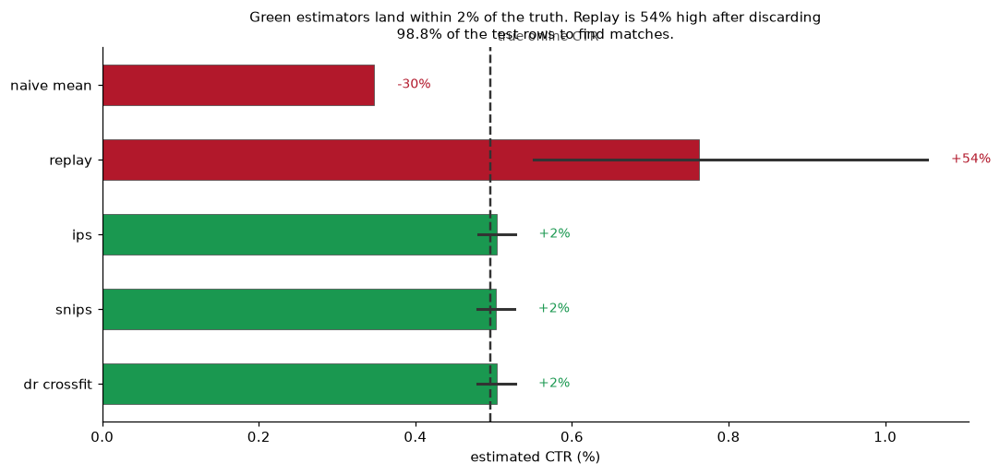
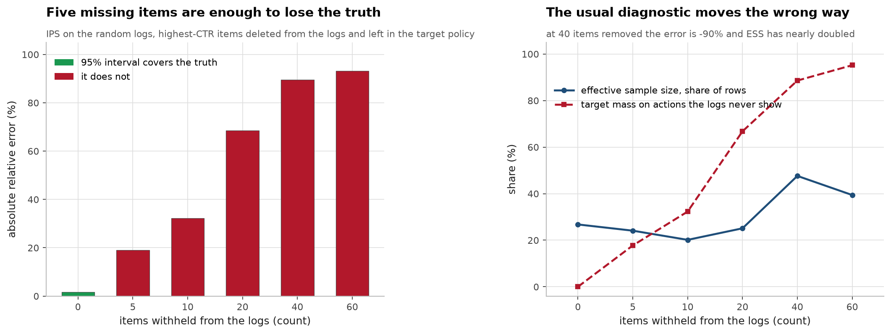
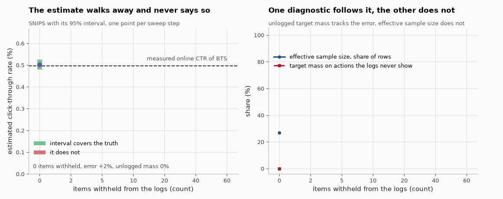
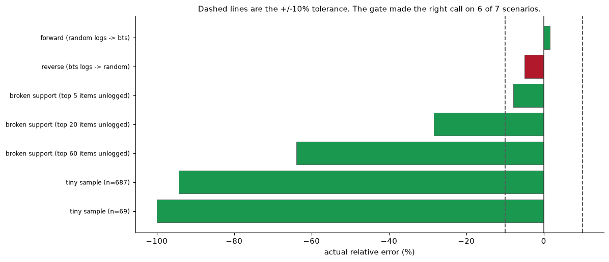

# Offline metrics vs online lift, checking recommender evaluation against a known answer

Offline recommender metrics decide whether a policy ships, and they are usually
validated against nothing. The **Open Bandit Dataset** (ZOZOTOWN) logged real
production traffic under a uniform-random policy and a Bernoulli Thompson Sampling
policy at the same time, and recorded the probability of every action taken, so
both policies' true online CTR is measured. The whole project is one question:
using only the random logs, can you work out how well BTS performs?

Every number here was produced by the code in this repo. Full write-up in
[notes/METHODS.md](notes/METHODS.md), decision trail with the wrong turns kept in
at [NOTES.md](NOTES.md).

## The known answer

7 days of live traffic, both policies running concurrently over 80 items.

| policy | impressions | clicks | CTR | 95% CI |
|---|---|---|---|---|
| uniform random | 1,374,327 | 4,768 | 0.00347 | [0.00337, 0.00357] |
| Bernoulli TS | 12,357,200 | 61,208 | 0.00495 | [0.00491, 0.00499] |

**BTS is +42.77% better than random**, p = 2.5e-166. That is the target every
estimator has to hit. Four fairness assumptions get checked rather than cited,
including that both policies ran the same 7 days, so BTS's higher CTR cannot just
be a better week: [notes/METHODS.md](notes/METHODS.md#1-the-known-answer).


## What the shortcuts get wrong

| estimator | estimate | error vs truth |
|---|---|---|
| quote the logged CTR | 0.00347 | **−30.0%** |
| replay / matched rows | 0.00763 | **+54.0%** |
| direct method, empirical | 0.00475 | −4.1% |
| direct method, logistic | 0.00355 | −28.4% |

Two reasonable-sounding methods disagree by 84 points and land on opposite sides
of the truth. Replay's error is bias, not small-sample noise: the true value sits
outside its 95% interval of [0.00551, 0.01054]. The logistic click model has the
respectable AUC, 0.5386, and the worse value estimate, so the supervised metric
ranks the two in the opposite order from the decision being made.
[Detail](notes/METHODS.md#2-what-the-naive-offline-evaluation-says).



## What the propensity correction fixes

| estimator | estimate | error vs truth | 95% CI | covers truth |
|---|---|---|---|---|
| IPS | 0.00504 | **+1.7%** | [0.00480, 0.00527] | yes |
| SNIPS | 0.00503 | **+1.6%** | [0.00479, 0.00527] | yes |
| doubly robust (cross-fitted) | 0.00503 | **+1.6%** | [0.00480, 0.00527] | yes |

A range of −30% to +54% collapses to under 2% and every interval covers the truth.
I predicted heavy-tailed weights and there are none: uniform logging caps the
largest weight in 1.37 million rows at 9.64. Clipping, the standard advice, only
adds bias here, and all four corrected estimators agree to within 0.1 points, so
this benchmark cannot separate them.
[Weights and the clipping sweep](notes/METHODS.md#3-what-the-propensity-correction-fixes).


## Where it breaks

Evaluating from uniform-random logs is the easy direction and nobody has those
logs in production, so: three stress tests, each still graded against a known
answer. Reversing the direction takes the largest weight from 9.6 to 12,500 and
effective sample size from 26.8% to 0.16%. Shrinking the data keeps the intervals
honest. Deleting the highest-CTR items from the logs is the one that breaks it,
and ESS does not merely miss that failure, it moves the wrong way: at 40 items
removed the estimate is off by −89.6% and ESS has gone up to 47.6%. What does
track the error, at no cost, is the target policy's probability mass on actions
the logs never saw. [Full stress tests](notes/METHODS.md#4-where-it-breaks).






*One step per frame, deleting the highest-CTR items from the logs. The
estimator and the target policy never change, so the drift away from the
measured true CTR line is support erosion alone.*

## The deliverable is a gate, not a model

`harness.audit()` returns a value only when the diagnostics pass, and otherwise
returns `value=None` plus the reasons, because a withheld number cannot be pasted
into a slide and a wrong one can. The thresholds are not fitted. Graded on
interval coverage against the known answers, 6 of 7 right at a 10% tolerance:

| scenario | gate | true error | unlogged mass | ESS | correct |
|---|---|---|---|---|---|
| forward (random → BTS) | ok | +1.6% | 0.0% | 367,933 | yes |
| reverse (BTS → random) | ok | −5.0% | 0.0% | 19,910 | **no** |
| top 5 items unlogged | refuse | −7.9% | 17.7% | 310,817 | yes |
| top 20 items unlogged | refuse | −28.3% | 66.8% | 259,170 | yes |
| top 60 items unlogged | refuse | −63.9% | 95.2% | 135,418 | yes |
| n = 687 | refuse | −94.3% | 4.6% | 196 | yes |
| n = 69 | refuse | −100.0% | 74.1% | 24 | yes |

The thresholds, the API and the two things I got wrong while building it are in
[notes/METHODS.md](notes/METHODS.md#5-the-deliverable-is-a-gate-not-a-model).



## Limitations

The gate's one false accept is the open problem. In the reverse direction its
interval [0.003131, 0.003464] misses the truth by 1.0 half-widths, because at max
weight 12,500 and ESS 0.16% the normal approximation behind the standard error is
marginally anti-conservative. Tightening a threshold to catch that would mean
picking the threshold by looking at the answer, so it stays documented; a
bootstrap or empirical-Bernstein interval is the honest fix. Everything here also
rests on one 7-day window from one retailer, and the BTS target policy is modelled
as context-free but position-dependent, matching the Open Bandit benchmark.

## Demo

```bash
uv run streamlit run app.py
# or
docker build -t roo . && docker run -p 7860:7860 roo
```

The gate's decision depends on three scalars, so the thresholds are live: move
them and the real gate logic re-runs on the full-data numbers above. True values
are shown on purpose, so you can watch the estimator be confidently wrong while
the gate withholds it.

## Reproducing

```bash
uv sync
curl -L -o data/obd.zip https://research.zozo.com/data_release/open_bandit_dataset.zip
unzip -q data/obd.zip -d data/          # 400 MB download, 11 GB unpacked

uv run python src/roo/prepare.py --campaigns all  # 7 GB csv -> 78 MB parquet
uv run python src/roo/eda.py all                  # the known answer
uv run python src/roo/baseline.py all             # the naive estimators
uv run python src/roo/ope.py all                  # IPS / SNIPS / DR
uv run python src/roo/stress.py all               # where the correction fails
uv run python src/roo/harness.py all              # the gate, scored against truth
uv run python src/roo/harness.py all --export-grid # data for the demo app

# self-checks: no dataset needed, so CI does not need the 11 GB download
uv run python src/roo/{baseline,ope,stress,harness}.py --self-check
```

Raw logs and the derived Parquet are gitignored. Stack and roadmap in
[notes/METHODS.md](notes/METHODS.md#9-stack).

## Layout

```
src/roo/    prepare, eda, baseline, ope, stress, harness, one per milestone
src/rsoo/   figure generation
reports/    json results and the figures above
app_data/   precomputed diagnostics for app.py, the Streamlit demo
notes/      METHODS.md, the full write-up
```

## Data, author, licence

[Open Bandit Dataset](https://research.zozo.com/data.html) (ZOZO Research),
released for research use.

Built by Aghasalim Mustafazada, a third-year Applied Computer Science (AI)
student. My code is MIT, see [LICENSE](LICENSE).

## References

The papers and sources this implementation follows. Each one is here because
the code uses the method, the dataset or the metric it describes.

- **Dudík, Langford, Li. Doubly Robust Policy Evaluation and Learning. ICML 2011.** [arXiv:1103.4601](https://arxiv.org/abs/1103.4601) the doubly robust estimator.
- **Swaminathan, Joachims. The Self-Normalized Estimator for Counterfactual Learning. NeurIPS 2015.** SNIPS, the self normalised variant.
- **Gilotte, Calauzènes, Nedelec, Abraham, Dollé. Offline A/B testing for Recommender Systems. WSDM 2018.** [arXiv:1801.07030](https://arxiv.org/abs/1801.07030) the offline versus online comparison this repo is built around.
